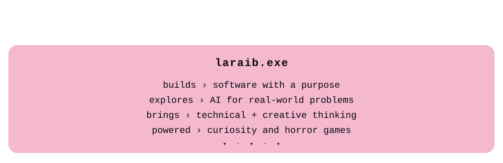
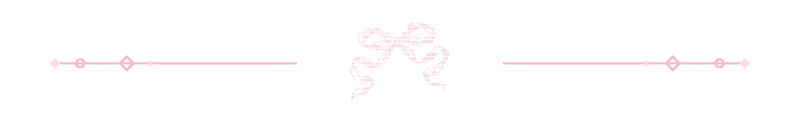
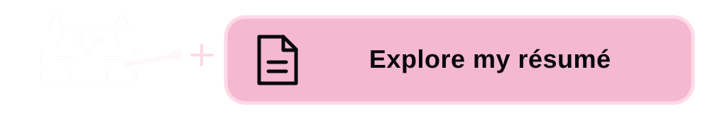

  

  <h2>୨ৎ About Me ୨ৎ</h2>

  

    I’m <strong>Laraib</strong>, a Computer Science student specializing in
    Applied AI and minoring in Supply Chain and Logistics Management at
    Oregon State University.
  

  

    I’m drawn to the part of technology where
    <strong>software, AI, and real-world operations meet</strong>.
    My experience includes building technical projects, introducing AI into
    an ERP-focused business, teaching programming as a Supplemental Instruction
    Leader, and leading initiatives across engineering organizations.
  

  

    My background in business, accounting, design, and media influences how I
    approach technology. I care about how something works, who it serves, how
    clearly it communicates, and whether it solves the right problem.
  

  

    I’m currently exploring software engineering and applied AI opportunities
    where I can combine technical problem-solving with creativity and an
    understanding of people.
  

 

  
˚₊‧ ୨୧ ‧₊˚　✦　˚₊‧ ୨୧ ‧₊˚

 

  

    ✦　　　　⋆　　　˚　　　　　✧　　　⋆｡　　　✦
  

  

    ୨ৎ　·　˚　──────　♡　──────　˚　·　୨ৎ
  

   

  
  &nbsp;&nbsp;
  

    

  

    ⋆｡　　✦　　　˚　　　·　　　✧　　　　⋆　　　✦
  

  

  

  <h2>Want to know more?</h2>

  

    Explore my experience, technical skills, leadership,
    and relevant coursework.
  

  

  

    ✦　·　˚　──────　♡　──────　˚　·　✦
  

  

    ୨ৎ　·　˚　──────　♡　──────　˚　·　୨ৎ
  

 
