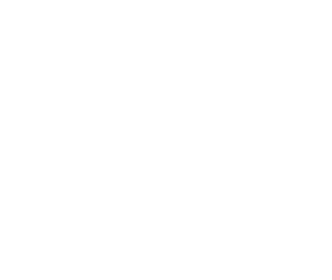
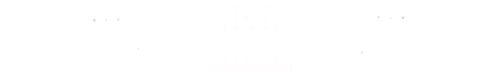

  

  <h2>୨ৎ About Me ୨ৎ</h2>

  

    I’m <strong>Laraib</strong>, a Computer Science student specializing in
    Applied AI and minoring in Supply Chain and Logistics Management at
    Oregon State University.
  

  

    I’m drawn to the part of technology where
    <strong>software, AI, and real-world operations meet</strong>.
    My experience includes building technical projects, introducing AI into
    an ERP-focused business, teaching programming as a Supplemental Instruction
    Leader, and leading initiatives across engineering organizations.
  

  

    My background in business, accounting, design, and media influences how I
    approach technology. I care about how something works, who it serves, how
    clearly it communicates, and whether it solves the right problem.
  

  

    I’m currently exploring software engineering and applied AI opportunities
    where I can combine technical problem-solving with creativity and an
    understanding of people.
  

 

  
˚₊‧ ୨୧ ‧₊˚　✦　˚₊‧ ୨୧ ‧₊˚

 

  

    ✦　　　　⋆　　　˚　　　　　✧　　　⋆｡　　　✦
  

  

    ୨ৎ　·　˚　──────　♡　──────　˚　·　୨ৎ
  

   

  
  &nbsp;&nbsp;
  

    

  

    ⋆｡　　✦　　　˚　　　·　　　✧　　　　⋆　　　✦
  

  

  

  <h2>Want to know more?</h2>

  

    Explore my experience, technical skills, leadership,
    and relevant coursework.
  

  

  

    ✦　·　˚　──────　♡　──────　˚　·　✦
  

 

  <h2>⌨ Tech Stack</h2>

  
<strong>Languages I’ve worked with</strong>

  

    
    &nbsp;&nbsp;
    
    &nbsp;&nbsp;
    
  

  
<strong>Tools & Frameworks</strong>

  

    
    &nbsp;&nbsp;
    
    &nbsp;&nbsp;
    
  

  

    
    &nbsp;&nbsp;
    
  

  

    ୨ৎ　·　˚　──────　♡　──────　˚　·　୨ৎ
  

  <h2>✦ Featured Projects ✦</h2>

  <table>
    <tr>
      <td width="50%" valign="top">
        <h3>🐈 OIIA Buddy</h3>
        

          A floating macOS companion that moves across the Dock,
          spins, pauses, and reacts with randomized sound.
        

        

          <strong>Swift · SwiftUI · AppKit · AVFoundation</strong>
        

        <a href="https://github.com/laraib-nadeem/oiia-buddy">
          <strong>View project →</strong>
        </a>
      </td>
      <td width="50%" valign="top">
        <h3>⌕ Text Search Engine</h3>
        

          A Python search tool that uses a custom hash table to
          count and retrieve word frequencies from text files.
        

        

          <strong>Python · Hash Tables · File Processing</strong>
        

        <a href="https://github.com/laraib-nadeem/text-search-engine">
          <strong>View project →</strong>
        </a>
      </td>
    </tr>
  </table>

  

    ✦　·　˚　──────　♡　──────　˚　·　✦
  

  <h2>✦ Contribution Activity ✦</h2>

  

    Small commits, growing projects, and everything I’m building along the way.
  

  

  <picture>
    
  </picture>

  

    ୨ৎ　·　˚　──────　♡　──────　˚　·　୨ৎ
  

